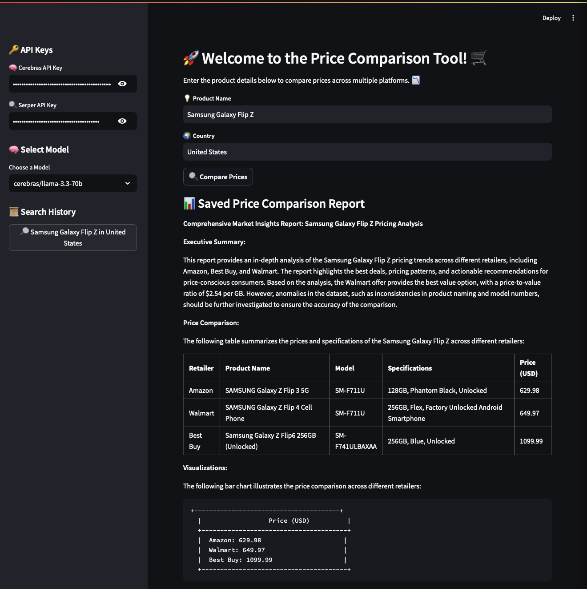
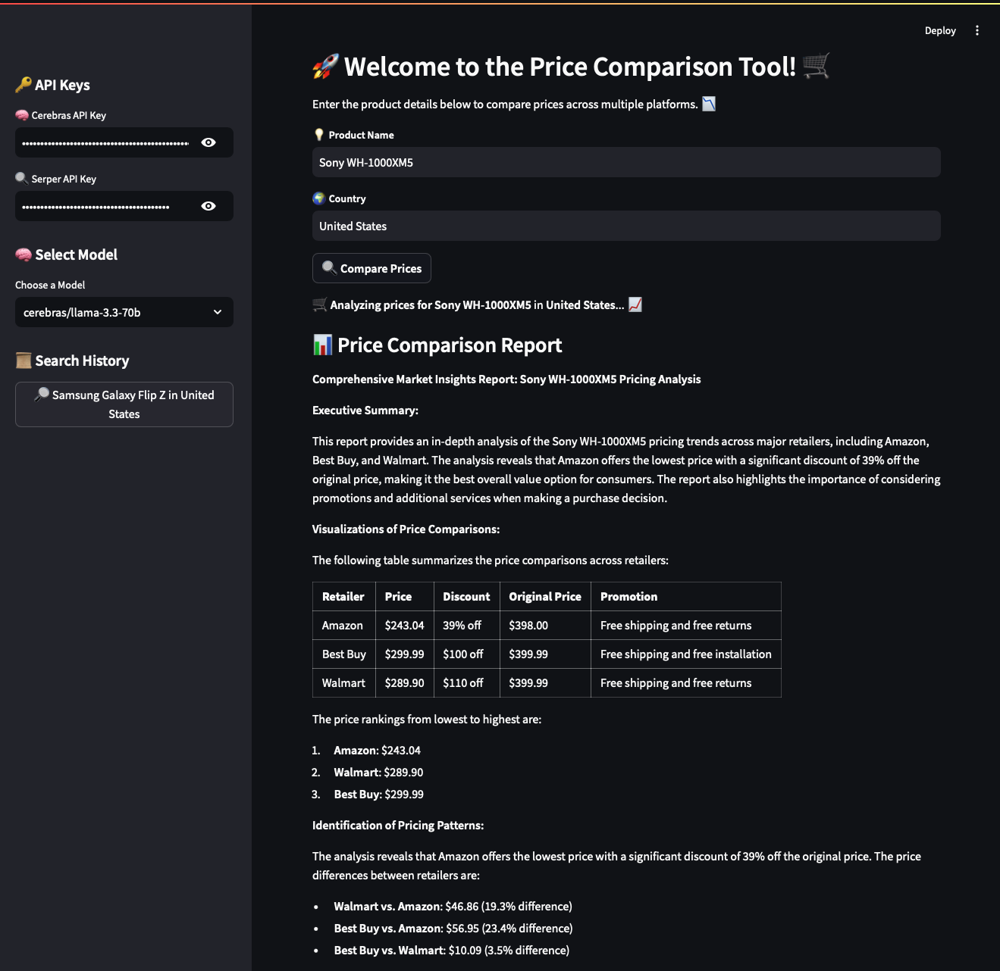

# 🛍️ **Price Comparison Agent** 🚀 using CrewAI and Cerebras 🤖

Welcome to the **Price Comparison Agent** project! 🎉 This tool automatically compares prices for your favorite products across various e-commerce platforms. Powered by **CrewAI** for orchestration, **Cerebras LLM** for high-performance language processing, and cutting-edge scraping tools, it gives you insights like never before! 💡

## 📚 Table of Contents
- [🌟 Overview](#overview)
- [🛠️ Technologies](#technologies)
- [📂 Project Structure](#project-structure)
- [⚙️ Installation](#installation)
- [🔑 Setup Environment Variables](#setup-environment-variables)
- [🚀 Usage](#usage)
- [🚧 Future Improvements](#future-improvements)
- [📝 License](#license)

---

## 🌟 Overview
This project automates the **price comparison** process using an orchestrated system of agents and tasks built on **CrewAI**! 🎯 The agents work together to:
1. **Collect pricing data** 🛒 from various e-commerce platforms.
2. **Clean** 🧹 the data for consistency and accuracy.
3. **Compare prices** 💲 to find the best deal.
4. **Generate a detailed report** 📊 with actionable insights.

### 🎯 Agents:
- **Search Agent:** Scours the web for price data on your selected product.
- **Data Cleaner:** Scrubs the collected data to ensure it’s clean and ready for analysis.
- **Price Comparison Expert:** Identifies the lowest price and price-to-value ratio.
- **Reporting Agent:** Summarizes all findings into a professional market insights report.

### 🧰 Tools:
- **SerperDevTool:** For scraping e-commerce platforms and gathering product details 🔍.
- **ScrapeWebsiteTool:** For extracting additional data from specific product pages 🌐.

### ⚡ Cerebras LLM: 
Powering our agents with state-of-the-art **language understanding** to generate insights! 🤖

---

## 🛠️ Technologies
Here’s what makes the magic happen 🔮:
- **CrewAI** 🧑‍💼: Orchestrating agents for intelligent automation.
- **Cerebras LLM** 🧠: High-performance language model for processing and reporting.
- **Streamlit** 🌐: Interactive web app for displaying results.
- **SerperDevTool & ScrapeWebsiteTool** 🔧: Web scraping tools to collect data.
- **Python** 🐍: The backbone of this project.

---

## Demo 




## 📂 Project Structure
Here’s the folder breakdown 🗂️:  
```bash
Price-Comparison-Agent/  
├── 📁 assets/
│   ├── 🖼️ crewcerebras1.png
│   └── 🖼️ crewcerebras2.png
├── 📁 src/
│   ├── 📁 __pycache__/ 🚫 (auto-hidden)
│   ├── 🐍 __init__.py
│   ├── 🐍 agents.py
│   ├── 🐍 config.py
│   ├── 🐍 crew.py
│   ├── 🐍 tasks.py
│   └── 🐍 tools.py
├── 📁 venv/ 🚫 (auto-hidden)
├── 📄 .DS_Store 🚫 (auto-hidden)
├── 🔒 .env 🚫 (auto-hidden)
├── 🚫 .gitignore
├── 📜 LICENSE
├── 📖 README.md
├── 🐍 app.py
├── 📄 requirements.txt
└── 📓 test.ipynb              
```

---

## ⚙️ Installation

Ready to get started? 🏁 Follow these simple steps to install and run the project:

1. **Clone the Repository:**
   ```bash
   git clone https://github.com/23csrohit/Price-Comparison-Agent.git
   cd Price-Comparison-Agent 
   ```

2. **Install Dependencies:**
Set up a virtual environment and install the required Python packages:
    ```bash
    python3 -m venv venv 
    source venv/bin/activate  
    pip install -r requirements.txt 
    ```

3. **Setup Environment Variables:**
    Create a .env file in the root directory. Add your API keys:    
    ```bash
    CEREBRAS_API_KEY=your_cerebras_api_key 
    SERPER_API_KEY=your_serper_api_key 
    ```

4. **Install Dependencies:**
    Fire up the app using Streamlit:
    ```bash
    streamlit run app.py 
    ```
    Go to http://localhost:8501 in your browser to start interacting with the tool! 🌐

## 🚀 Usage

Once you’re running the Streamlit app, simply:

1. **Enter Product Name** 🏷️ (e.g., “Sony WH-1000XM5”).
2. **Enter Country** 🌍 (e.g., “United States”).
3. Click **"Compare Prices"** 💸.

The app will:
- **Search for prices** across major platforms 🛍️.
- **Clean and standardize the data** 🧼.
- **Compare the lowest prices** and show you the best deals 📊.
- **Generate a detailed report** with pricing trends and recommendations 📑.


## 🚧 Future Improvements

Let’s make this tool even better! Here’s what we plan to add next:

- **🌎 Multi-country Support**: Compare prices across different regions.
- **🛍️ More Platforms**: Expand to include even more e-commerce platforms.
- **🔄 Real-time Updates**: Keep prices up-to-date in real time.
- **📱 Price Alerts**: Notify users when a product’s price drops below a certain threshold.


## 📝 License

This project is licensed under the MIT License. See the LICENSE file for details. ⚖️